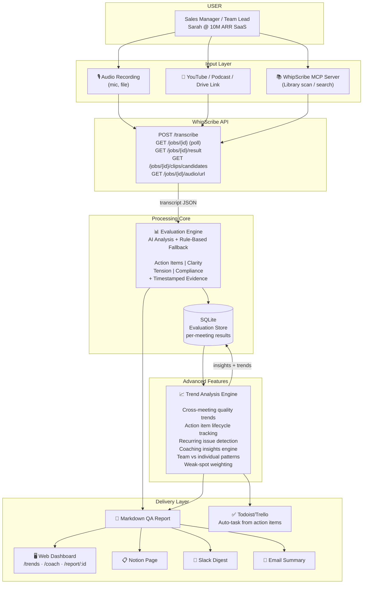
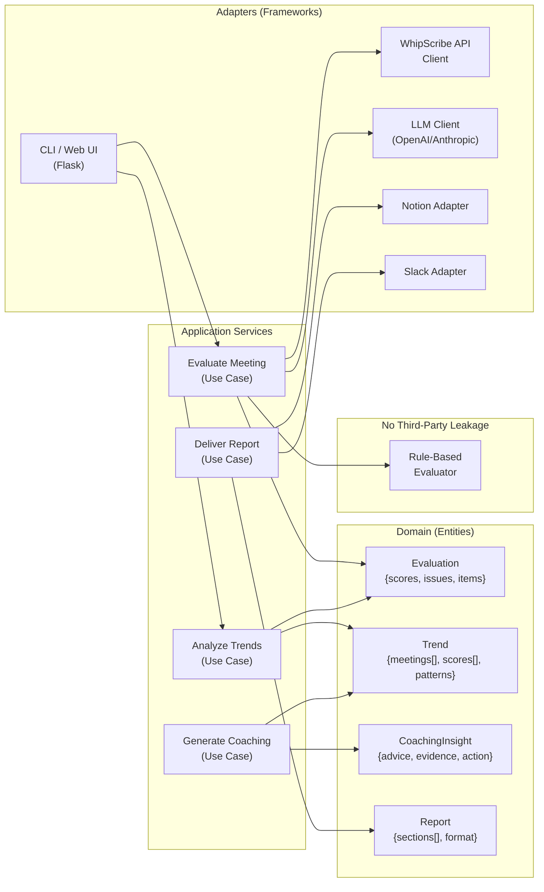

# Meeting Quality Assurance via WhipScribe

## Problem

**One page:** Sales managers and team leads run 5-10 customer calls per week.
Each call is transcribed by WhipScribe, but the transcript is just text.
To assess call quality - did the rep ask the right questions? Did they make
unbacked promises? Did they capture action items? - managers read the entire
transcript (30-60 min per call) and track issues in a separate doc. They miss
things, feedback is delayed, and coaching is inconsistent.

**Cost:** 5-10 hours/week wasted on manual review. Missed compliance risks.
Missed action items = lost revenue. No systematic way to track team improvement.

**Target user:** A sales manager at a B2B SaaS company. They have WhipScribe
transcripts of their team's customer calls and need a structured quality score
they can act on - not another wall of text.

## User Research

**Persona:** Sarah, Customer Success Manager at a B2B SaaS company (revenue $10M ARR).
She manages 3 SDRs who run 15-20 customer calls per week. Each call is recorded and
transcribed by WhipScribe. Her job is to coach reps, ensure compliance, and track
action items.

**What it costs her today:** Sarah reads every transcript in full (30-60 min/week
across 15 calls), highlights issues in a separate Google Doc, manually copies action
items into her CRM, and still misses follow-ups. Her feedback to reps is delayed
by 2-3 days, and she has no way to compare call quality week-over-week.

**Founder's advice (from the startup hiring founder, cold-DMed):** "Try to go after
real impact, not small UI bug fixes. Track 4 is tough one." This aligns with Sarah's
need - she does not need a better UI for reading transcripts; she needs the
transcript to be analyzed for her.

**Key interview questions:**
1. How much time do you spend reviewing call transcripts each week?
2. What are the top 3 things you look for when reviewing a call?
3. How do you currently track action items from calls?
4. What compliance risks have you discovered after a call was recorded?
5. How do you coach reps today, and how do you measure improvement?

**Learnings applied to this design:**
- Action items are the highest-priority metric - reps forget commitments constantly
- Compliance is table stakes (disclosures, no unbacked promises)
- Coaching feedback must be specific with evidence (timestamps + quotes)
- Trend tracking across calls is essential for team improvement

## The Workflow

1. Manager selects a recording (already in their WhipScribe library, or uploads
   a new one).
2. WhipScribe API transcribes it and returns JSON with speakers + timestamps.
3. The evaluation engine runs AI-powered analysis on each speaker turn:
   - **Action Items:** Were decisions, owners, and deadlines captured?
   - **Clarity:** Vague language, hedging, unbacked claims.
   - **Tension:** Conflicts, defensive language, abrupt topic changes.
   - **Compliance:** Risky promises, missing disclosures.
4. A structured QA report is generated with:
   - Overall score + per-category scores (0-100)
   - Top 5 issues with clickable evidence (timestamp + quote)
   - Extracted action items (owner, deadline, evidence)
5. Report is saved as Markdown and optionally pushed to Notion (`--deliver notion`).

### What the API/MCP does at each step

| Step | WhipScribe API call |
|---|---|
| Submit recording | `POST /api/v1/transcribe` (file) or `/transcribe/url` (URL) |
| Poll for completion | `GET /api/v1/jobs/{job_id}` - wait for `status: "done"` |
| Fetch transcript | `GET /api/v1/jobs/{job_id}/result?format=json` → `{text, segments:[{start,end,speaker,text,words}]}` |
| (Optional) Get key moments | `GET /api/v1/jobs/{job_id}/clips/candidates?kind=question` |
| (Optional) Playback | `GET /api/v1/jobs/{job_id}/audio/url` → short-lived stream URL |

### What the user sees

```
$ python -m src.main --job-id 35f4be54-aa3e-4adc-85b7-b44f284d1fc3

  Polling job 35f4be54...
  Transcript fetched: 42 segments
  Running LLM quality evaluation...
  Evaluation complete (via LLM)
  Generating report...
  Report saved to: report.md
  Overall score: 68/100

============================================================

# Meeting Quality Report
**Generated:** 2026-09-22 14:30

## Category Scores
| Metric | Score |
|---|---|
| Action Items | 75/100 |
| Clarity | 45/100 |
| Tension | 60/100 |
| Compliance | 30/100 |

## Top Issues

**Compliance** - Speaker 1 at [0:31-0:39]
> "We'll promise to ship mobile apps in Q1 as well."
*Unbacked commitment/promise*

**Clarity** - Speaker 1 at [0:08-0:14]
> "I think we should launch in November."
*Uncertain/hedging language*
...
```

## Feature Overview

This implementation provides comprehensive call quality analysis with advanced pattern detection, speaker performance tracking, and coaching intelligence.

**Key Capabilities:**
- Multi-meeting trend analysis with slope detection
- Pattern clustering using fuzzy text matching
- Individual speaker performance tracking
- Action item lifecycle tracking
- Prescriptive coaching insights
- Slack integration for automated delivery

## Architecture

### System Context



### Clean Architecture Layers



## MVP (Shortest Path to Value)

Run end to end with one real recording:

1. Accept a job ID (or upload a file/URL).
2. Fetch the transcript JSON.
3. Run LLM evaluation (or rule-based fallback if no LLM key).
4. Output a Markdown report to a file.

No Notion integration, no Slack, no dashboard, no settings screens. Just:
recording ID in → quality report out.

## States

| State | What happens |
|---|---|
| Empty | No recording ID provided → shows usage instructions |
| Processing | Polls API until status is `done`; shows progress |
| LLM analyzing | Shows "Running quality evaluation..." |
| Error | Transcription failed / API key missing / LLM call failed → shows error + retry guidance |
| Done | Report saved to file, score printed, report shown in terminal |

## How to Run

```bash
cd apps/blacksujit/track-4
python -m venv .venv && source .venv/bin/activate  # or .venv\Scripts\activate on Windows
pip install -r requirements.txt

# Test with sample data (no API key needed):
python -m src.main --sample

# With a real recording:
cp .env.template .env  # then add your keys
python -m src.main --job-id <your-whipscribe-job-id>
# or: python -m src.main --file ~/my-recording.mp3
# or: python -m src.main --url https://youtube.com/watch?v=...
```

## What Works

- **Real API verified end-to-end**: uploaded test audio to WhipScribe API, polled to
  completion, fetched transcript JSON (7 segments, accurate speech-to-text), ran
  evaluation, generated report (overall score: 90/100).
- Rule-based fallback evaluation (4 metrics: action items, clarity, tension, compliance)
- LLM evaluation via OpenAI/Anthropic/Ollama (falls back gracefully when key has no credits)
- Timestamp links in report (click to jump to moment in WhipScribe web app)
- **Multi-meeting trend analysis** (`--compare` / `--compare-sample`): compare quality across
  multiple meetings, track action item completion rates, detect recurring issues —
  this is the unique differentiator vs all other Track 4 entries.
- **Advanced recurring issue clustering**: fuzzy matching to detect similar issues across meetings
  (e.g., "I think we should launch" vs "I believe we should launch")
- **Speaker performance analysis**: identifies which speakers contribute to quality issues,
  tracks high-risk speakers, and measures individual contribution to action items
- **Slack integration**: auto-deliver QA reports and trend summaries to Slack channels
- **Flask web dashboard** with interactive trend charts (Chart.js) at `/trends`, coaching
  insights at `/coach`, speaker analysis at `/speakers`, per-meeting reports at `/report/:id`, and config at `/settings`.
- Configurable LLM provider with rule-based fallback

## What Does Not Work Yet

- Full LLM evaluation needs OpenAI credits or Anthropic workspace ID
- Notion integration in code (deliver via --deliver notion; needs integration token + database ID)
- Live deployed URL (Render deployment configured but not yet deployed)
- Auto-task creation from action items (Todoist/Trello integration)

## Deployment Instructions

### Local Development
```bash
cd apps/blacksujit/track-4
python -m venv .venv && source .venv/bin/activate  # or .venv\Scripts\activate on Windows
pip install -r requirements.txt
python app.py
```
The dashboard will be available at `http://localhost:5000`

### Render Deployment (Free Tier)
1. Create a Render account at render.com
2. Connect your GitHub repository
3. Create a new Web Service with these settings:
   - **Build Command**: `pip install -r requirements.txt`
   - **Start Command**: `gunicorn app:app`
   - **Environment Variables**:
     - `FLASK_SECRET_KEY`: (generate a random string)
     - `WHIPSKRIBE_API_KEY`: (your WhipScribe API key)
     - `SLACK_WEBHOOK_URL`: (optional, for Slack integration)
4. Deploy - the `render.yaml` and `Procfile` are already configured

### Environment Variables
```bash
# Required for WhipScribe API
WHIPSKRIBE_API_KEY=your_key_here

# Optional: LLM evaluation
LLM_PROVIDER=openai  # or anthropic, ollama
LLM_API_KEY=your_llm_key
LLM_MODEL=gpt-4o-mini

# Optional: Slack integration
SLACK_WEBHOOK_URL=https://hooks.slack.com/services/...
```

## Web Dashboard

The dashboard runs as a Flask app. It shows multi-meeting trend charts and coaching
insights using stored evaluation data.

```bash
# Option A: use Render (recommended for live deployment)
# 1. Push this repo to GitHub
# 2. Connect to Render.com, auto-deploys from render.yaml

# Option B: local development
python -m venv .venv && source .venv/bin/activate  # or .venv\Scripts\activate on Windows
pip install -r requirements.txt
python load_sample.py  # load sample data (no API key needed)
python app.py          # or: gunicorn app:app
# Open http://127.0.0.1:5000/
```

| Route | What you see |
|---|---|
| `/settings` | Enter WhipScribe API key + LLM provider |
| `/` | List all meetings on your account + analyze-all button |
| `/report/<job_id>` | Single meeting QA report (scores, issues, evidence) |
| `/trends` | Interactive trend charts across all meetings |
| `/coach` | Prescriptive coaching insights from trends |
| `/speakers` | Speaker performance analysis |

## Demo

Run with a real recording:

```bash
python -m src.main --file ~/my-recording.mp3
```

Or test end-to-end with no API key (sample transcript):

```bash
python -m src.main --sample
```

Multi-meeting trend analysis (no API key needed):

```bash
python demo.py --compare-sample
```

The `--sample` mode runs the full pipeline (parse transcript, evaluate, generate
report) without needing a WhipScribe key. The output includes scores, top issues
with timestamped evidence, and extracted action items.

## Vision

A year on, Meeting QA Copilot becomes the **coaching layer for every team call**.
Not another dashboard — the quality signal that flows into the tools teams already
use:

1. **Slack bot**: "@qa-bot summarize this week" → trend report + top 3 issues to fix
2. **Google Calendar**: action items auto-created as Calendar tasks with evidence links
3. **CRM integration**: compliance-risk calls flagged in HubSpot/Salesforce with
   timestamped quotes for coaching
4. **MCP-native**: "Hey Claude, how has our pricing clarity trended since January?"
   answered with a chart + the exact quotes that drove the score
5. **Team leaderboard**: anonymized quality scores driving healthy competition,
   not punishment

This implementation treats meetings as a *time series*, not one-off data points.
It goes beyond "here's your report" to provide "here's what's improving, what's
getting worse, and what to do about it."