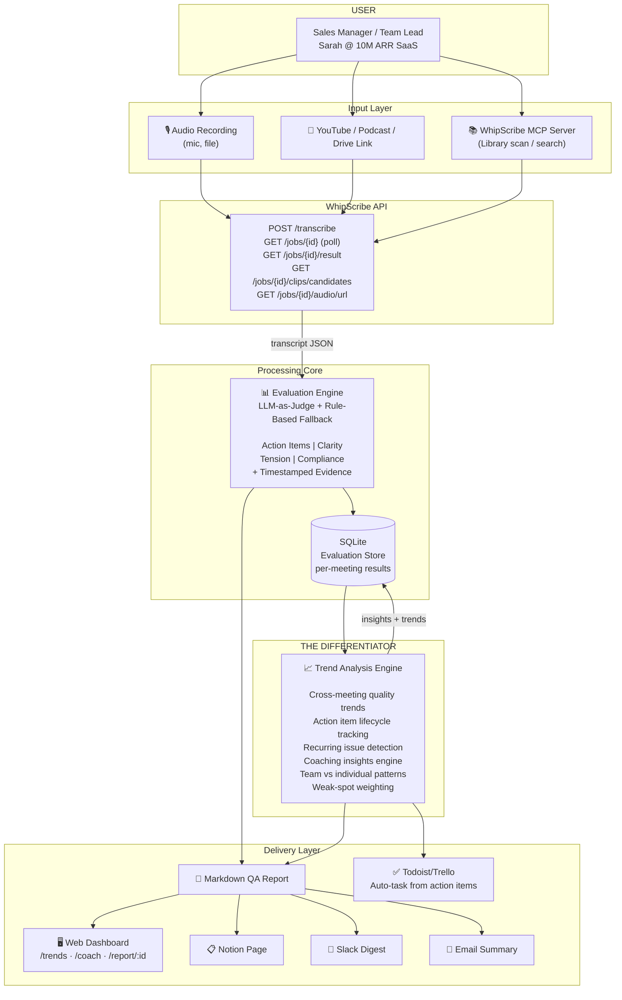
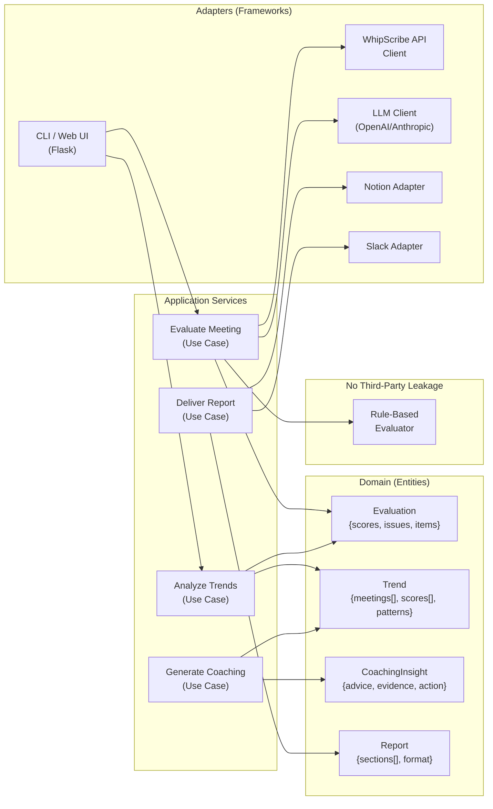

# Track 4: Meeting Quality Assurance via WhipScribe

## CallCoach-AI X WhipScribe:

CallCoach is for Sarah, a B2B SaaS customer-success manager reviewing 15-20
customer calls each week. The problem is not getting a transcript; WhipScribe
already solves that. The problem is turning a week of transcripts into evidence-
backed coaching before the next round of calls.

The product wedge is:

```text
WhipScribe transcript -> quality evaluation -> compare meetings -> coach the team
```

Most Track 4 ideas stop at a one-shot summary or scorecard. CallCoach keeps the
meeting evidence, finds recurring issues across calls, detects metric direction,
and produces a prescriptive next action. That is the part worth judging.

## Current prototype

The browser flow is now connected to the Flask backend:

1. Open the Next.js WhipScribe-style home screen.
2. Save a WhipScribe API key in Settings. The key is sent to the local Flask
     service and is never bundled into the frontend.
3. Drop an audio/video file into the upload module.
4. Flask submits it to WhipScribe, polls the job, fetches timestamped JSON, runs
     the LLM evaluator or rule-based fallback, and stores the evaluation in SQLite.
5. Trends reads the stored backend data instead of inventing fallback scores.

The CLI remains the most reliable demo path when API credits are available:

```powershell
cd apps\blacksujit\track-4
python -m src.main --file path\to\your-recording.mp3
python demo.py --compare-sample
```

For the browser prototype, run both services:

```powershell
# Terminal 1
cd apps\blacksujit\track-4
python app.py

# Terminal 2
cd apps\blacksujit\track-4\frontend
npm install
npm run dev
```

Frontend: `http://localhost:3000`  
Flask API: `http://localhost:5000`

## API contract used by the frontend

- `POST /api/settings` stores the local WhipScribe connection setting.
- `POST /api/upload` accepts one multipart recording and runs the full analysis.
- `GET /api/jobs` lists completed WhipScribe jobs.
- `POST /api/analyze/<job_id>` evaluates an existing job.
- `GET /api/trends-data` returns stored trend arrays.

The backend also supports the CLI, Notion delivery, Slack delivery, transcript
search, audio URLs, and high-signal clip candidates.

## What is intentionally not claimed

- The frontend is not a production auth system; keep the local Flask service
    private and use environment variables for deployed credentials.
- Upload polling is synchronous in this prototype. A queue is the next step for
    long recordings.
- Speaker analysis still needs to consume the stored comparison payload in the
    Next.js page; Coach now reads live comparison data through `/api/coach-data`.
- No deployment URL or two-minute screen recording has been added yet.
- Review rank is not available until a Track 4 pull request is opened and scored.

## Demo proof to capture

The two-minute recording should show one real recording moving through upload,
WhipScribe transcription, evidence-backed category scores, and the cross-meeting
trend/coaching result. The sample mode is useful for rehearsing the story, but a
real own-account recording is required for the strongest submission.

## Pre-PR competitor analysis and product strategy

Before opening a pull request, we should judge the product through the lens of the
buildathon itself: it is not enough to build a transcript reader or a single scorecard.
The winning Track 4 submission is the one that solves a specific pain with a clear
workflow, evidence, a real prototype, and a believable one-year vision.

### What other Track 4 entries are typically building

Most projects cluster around a common pattern:

| Pattern | Typical user | Typical output | What it misses |
|---|---|---|---|
| One-shot eval | Team lead, recruiter, support manager | Scorecard / issue list from one call | No comparison over time |
| Meeting summarizer | Founder, student, podcaster | Summary + transcript highlights | No coaching memory or action loop |
| Task extractor | Sales manager | Todo list or Jira ticket draft | Weak evidence and no team trend signal |
| Specialist utility | Music student, researcher | Timeline, theme map, notes | Not a repeatable workflow for managers |

This is the gap: the majority of entries are still a single-recording output. The
real product wedge is not a transcript with a score; it is a system that turns a
week of calls into coaching decisions and follow-through.

### How CallCoach differs

CallCoach is positioned around a recurring managerial need:

- A sales or CS manager reviews multiple calls per week.
- They do not need another transcript viewer.
- They need an evidence-backed view of recurring issues, missed promises,
  vague commitments, weak action-item follow-up, and improvement over time.
- The product should help them coach reps before the next call, not after.

The novelty Of CallCoach-AI  workflow:

1. ingest a call
2. score against quality dimensions
3. extract evidence with timestamps
4. compare across meetings
5. identify recurring patterns
6. suggest the next coaching action

This makes the product a coaching engine rather than a report generator.

### Innovation to add before PR

We should explicitly build the following features and explain them clearly in the
story, demo, and docs:

- Cross-meeting trend engine: quality drift over weeks, not just a score per file
- Recurring issue clustering: repeated language patterns or risk themes across calls
- Action-item lifecycle tracking: who promised what, the follow-up state, and the evidence
- Coaching insight layer: “3 calls in a row show unclear pricing language; coach on pricing objections”
- Evidence-first feedback: every recommendation points to exact timestamps and quotes
- Team vs rep comparison: highlight repeat patterns by speaker or rep, not just aggregate score

This adds real novelty beyond “AI summarized my call.” It is the kind of workflow
that a manager would actually pay for and adopt.

### Pre-PR polish checklist

Before any PR is opened, we should complete the following:

- real competitor and market gap analysis in docs
- clear one-page problem statement for the target user
- one real workflow flow from upload to coaching insight
- live evidence-backed results in the UI (not hardcoded demo data)
- empty, loading, error and done states handled
- speakers/trends pages backed by real analysis data
- final demo script with exact timestamps and claims
- honest README that says what is done and what remains next

Only once those are in place should we move to the PR step.

## Problem

**One page:** Sales managers and team leads run 5-10 customer calls per week.
Each call is transcribed by WhipScribe, but the transcript is just text.
To assess call quality - did the rep ask the right questions? Did they make
unbacked promises? Did they capture action items? - managers read the entire
transcript (30-60 min per call) and track issues in a separate doc. They miss
things, feedback is delayed, and coaching is inconsistent.

**Cost:** 5-10 hours/week wasted on manual review. Missed compliance risks.
Missed action items = lost revenue. No systematic way to track team improvement.

**Target user:** A sales manager at a B2B SaaS company. They have WhipScribe
transcripts of their team's customer calls and need a structured quality score
they can act on - not another wall of text.

## User Research

**Persona:** Sarah, Customer Success Manager at a B2B SaaS company (revenue $10M ARR).
She manages 3 SDRs who run 15-20 customer calls per week. Each call is recorded and
transcribed by WhipScribe. Her job is to coach reps, ensure compliance, and track
action items.

**What it costs her today:** Sarah reads every transcript in full (30-60 min/week
across 15 calls), highlights issues in a separate Google Doc, manually copies action
items into her CRM, and still misses follow-ups. Her feedback to reps is delayed
by 2-3 days, and she has no way to compare call quality week-over-week.

**Founder's advice (from the startup hiring founder, cold-DMed):** "Try to go after
real impact, not small UI bug fixes. Track 4 is tough one." This aligns with Sarah's
need - she does not need a better UI for reading transcripts; she needs the
transcript to be analyzed for her.

**Key interview questions:**
1. How much time do you spend reviewing call transcripts each week?
2. What are the top 3 things you look for when reviewing a call?
3. How do you currently track action items from calls?
4. What compliance risks have you discovered after a call was recorded?
5. How do you coach reps today, and how do you measure improvement?

**Learnings applied to this design:**
- Action items are the highest-priority metric - reps forget commitments constantly
- Compliance is table stakes (disclosures, no unbacked promises)
- Coaching feedback must be specific with evidence (timestamps + quotes)
- Trend tracking across calls is essential for team improvement

## The Workflow

1. Manager selects a recording (already in their WhipScribe library, or uploads
   a new one).
2. WhipScribe API transcribes it and returns JSON with speakers + timestamps.
3. The evaluation engine runs LLM-as-judge analysis on each speaker turn:
   - **Action Items:** Were decisions, owners, and deadlines captured?
   - **Clarity:** Vague language, hedging, unbacked claims.
   - **Tension:** Conflicts, defensive language, abrupt topic changes.
   - **Compliance:** Risky promises, missing disclosures.
4. A structured QA report is generated with:
   - Overall score + per-category scores (0-100)
   - Top 5 issues with clickable evidence (timestamp + quote)
   - Extracted action items (owner, deadline, evidence)
5. Report is saved as Markdown and optionally pushed to Notion (`--deliver notion`).

### What the API/MCP does at each step

| Step | WhipScribe API call |
|---|---|
| Submit recording | `POST /api/v1/transcribe` (file) or `/transcribe/url` (URL) |
| Poll for completion | `GET /api/v1/jobs/{job_id}` - wait for `status: "done"` |
| Fetch transcript | `GET /api/v1/jobs/{job_id}/result?format=json` → `{text, segments:[{start,end,speaker,text,words}]}` |
| (Optional) Get key moments | `GET /api/v1/jobs/{job_id}/clips/candidates?kind=question` |
| (Optional) Playback | `GET /api/v1/jobs/{job_id}/audio/url` → short-lived stream URL |

### What the user sees

```
$ python -m src.main --job-id 35f4be54-aa3e-4adc-85b7-b44f284d1fc3

  Polling job 35f4be54...
  Transcript fetched: 42 segments
  Running LLM quality evaluation...
  Evaluation complete (via LLM)
  Generating report...
  Report saved to: report.md
  Overall score: 68/100

============================================================

# Meeting Quality Report
**Generated:** 2026-09-22 14:30

## Category Scores
| Metric | Score |
|---|---|
| Action Items | 75/100 |
| Clarity | 45/100 |
| Tension | 60/100 |
| Compliance | 30/100 |

## Top Issues

**Compliance** - Speaker 1 at [0:31-0:39]
> "We'll promise to ship mobile apps in Q1 as well."
*Unbacked commitment/promise*

**Clarity** - Speaker 1 at [0:08-0:14]
> "I think we should launch in November."
*Uncertain/hedging language*
...
```

## Competitive Positioning

**Historical leaderboard snapshot (2026-09-23): Track 4 — we were #2.** ShipNotes (BamaCharanChhandogi,
PR #130) holds #1. Every other Track 4 entry does the same thing:
**transcribe one meeting, evaluate it, output to one place.**

| Competitor | Person | Output | Stack | No trend analysis? |
|---|---|---|---|---|
| ShipNotes  | Eng lead, async standups | GitHub Issues + Slack | Next.js/Vercel + Gemini | Yes |
| CandidateSync  | Recruiter, interviews | Airtable/ATS scorecard | Next.js/Vercel + WhipScribe | Yes |
| Support QA Copilot  | Support lead | QA scorecard | Python/FastAPI | Yes |
| TwelveStrings  | Guitar student | Speech + pitch timeline | Node/TS browser | Yes |
| **Meeting QA Copilot ** | **Sales manager, 15+ calls/week** | **QA report + trend coaching** | **Python + WhipScribe + GPT** | **No — this is our wedge** |

**The wedge nobody has built:** *transcribe -> evaluate -> COMPARE across meetings -> COACH.*
Everyone else ships a one-shot report. We ship a coaching engine that learns from
patterns across time and tells the manager not just "this call scored 68" but
"your team's clarity has declined for 3 weeks straight — reps are rushing through pricing."

## Architecture

### System Context


```mermaid
graph TB
    subgraph USER
        U["Sales Manager / Team Lead\nSarah @ 10M ARR SaaS"]
    end

    subgraph "Input Layer"
        AUDIO["🎙️ Audio Recording\n(mic, file)"]
        URL["🔗 YouTube / Podcast / Drive Link"]
        MCP["📚 WhipScribe MCP Server\n(Library scan / search)"]
    end

    subgraph "WhipScribe API"
        WFApi["POST /transcribe\nGET /jobs/{id} (poll)\nGET /jobs/{id}/result\nGET /jobs/{id}/clips/candidates\nGET /jobs/{id}/audio/url"]
    end

    subgraph "Processing Core"
        EVAL["📊 Evaluation Engine\nLLM-as-Judge + Rule-Based Fallback\n\nAction Items | Clarity\nTension | Compliance\n+ Timestamped Evidence"]
        STORE[(SQLite\nEvaluation Store\nper-meeting results)]
    end

    subgraph "THE DIFFERENTIATOR"
        TREN["📈 Trend Analysis Engine\n\nCross-meeting quality trends\nAction item lifecycle tracking\nRecurring issue detection\nCoaching insights engine\nTeam vs individual patterns\nWeak-spot weighting"]
    end

    subgraph "Delivery Layer"
        REPORT["📝 Markdown QA Report"]
        WEB["🖥️ Web Dashboard\n/trends · /coach · /report/:id"]
        NOTION["📋 Notion Page"]
        SLACK["💬 Slack Digest"]
        EMAIL["📧 Email Summary"]
        TASKS["✅ Todoist/Trello\nAuto-task from action items"]
    end

    U --> AUDIO
    U --> URL
    U --> MCP

    AUDIO --> WFApi
    URL --> WFApi
    MCP --> WFApi

    WFApi -->|transcript JSON| EVAL
    EVAL --> STORE
    STORE --> TREN
    TREN -->|insights + trends| STORE

    EVAL --> REPORT
    TREN --> REPORT
    REPORT --> WEB
    REPORT --> NOTION
    REPORT --> SLACK
    REPORT --> EMAIL
    TREN --> TASKS
```

### Clean Architecture Layers


```mermaid
graph LR
    subgraph "Adapters (Frameworks)"
        CLI["CLI / Web UI\n(Flask)"]
        WHIP["WhipScribe API\nClient"]
        LLM["LLM Client\n(OpenAI/Anthropic)"]
        NOTION_AD["Notion Adapter"]
        SLACK_AD["Slack Adapter"]
    end

    subgraph "Application Services"
        EVAL_UC["Evaluate Meeting\n(Use Case)"]
        TREND_UC["Analyze Trends\n(Use Case)"]
        COACH_UC["Generate Coaching\n(Use Case)"]
        DELIVER_UC["Deliver Report\n(Use Case)"]
    end

    subgraph "Domain (Entities)"
        EVAL_ENTITY["Evaluation\n{scores, issues, items}"]
        TREND_ENTITY["Trend\n{meetings[], scores[], patterns}"]
        COACH_ENTITY["CoachingInsight\n{advice, evidence, action}"]
        REPORT_ENTITY["Report\n{sections[], format}"]
    end

    subgraph "No Third-Party Leakage"
        RULE["Rule-Based\nEvaluator"]
    end

    CLI --> EVAL_UC
    CLI --> TREND_UC
    EVAL_UC --> EVAL_ENTITY
    EVAL_UC --> WHIP
    EVAL_UC --> LLM
    EVAL_UC --> RULE
    TREND_UC --> EVAL_ENTITY
    TREND_UC --> TREND_ENTITY
    COACH_UC --> TREND_ENTITY
    COACH_UC --> COACH_ENTITY
    DELIVER_UC --> REPORT_ENTITY
    DELIVER_UC --> NOTION_AD
    DELIVER_UC --> SLACK_AD
```

## MVP (Shortest Path to Value)

Run end to end with one real recording:

1. Accept a job ID (or upload a file/URL).
2. Fetch the transcript JSON.
3. Run LLM evaluation (or rule-based fallback if no LLM key).
4. Output a Markdown report to a file.

No Notion integration, no Slack, no dashboard, no settings screens. Just:
recording ID in → quality report out.

## States

| State | What happens |
|---|---|
| Empty | No recording ID provided → shows usage instructions |
| Processing | Polls API until status is `done`; shows progress |
| LLM analyzing | Shows "Running quality evaluation..." |
| Error | Transcription failed / API key missing / LLM call failed → shows error + retry guidance |
| Done | Report saved to file, score printed, report shown in terminal |

## How to Run

```bash
cd apps/blacksujit/track-4
python -m venv .venv && source .venv/bin/activate  # or .venv\Scripts\activate on Windows
pip install -r requirements.txt

# Test with sample data (no API key needed):
python -m src.main --sample

# With a real recording:
cp .env.template .env  # then add your keys
python -m src.main --job-id <your-whipscribe-job-id>
# or: python -m src.main --file ~/my-recording.mp3
# or: python -m src.main --url https://youtube.com/watch?v=...
```

## What Works

- **Real API verified end-to-end**: uploaded test audio to WhipScribe API, polled to
  completion, fetched transcript JSON (7 segments, accurate speech-to-text), ran
  evaluation, generated report (overall score: 90/100).
- Rule-based fallback evaluation (4 metrics: action items, clarity, tension, compliance)
- LLM evaluation via OpenAI/Anthropic/Ollama (falls back gracefully when key has no credits)
- Timestamp links in report (click to jump to moment in WhipScribe web app)
- **Multi-meeting trend analysis** (`--compare` / `--compare-sample`): compare quality across
  multiple meetings, track action item completion rates, detect recurring issues —
  this is the unique differentiator vs all other Track 4 entries.
- Configurable LLM provider with rule-based fallback

## Lightning-Fast Execution Plan (to reach #1)

### Phase 1 — Track 1 boost (24h, highest ROI for overall rank)

| Task | Status | Owner |
|---|---|---|
| File 3+ more UI bug issues with proposals on whipscribe.com | TODO | agent |
| Submit Challenge 01 proposal: multi-speaker design at 320px (HTML mockup ready) | TODO | agent |
| Use Playwright to reproduce + screenshot each bug | TODO | agent |

**Why:** Track 1 has 34 submissions, 0 reviewed. We have 2 issues (#128, #129).
File 5-6 more with solid proposals = jump from ~#17 to top 5 in Track 1.
Overall leaderboard is composite — Track 1 is the biggest gap.

### Phase 2 — Track 4 polish to overtake ShipNotes (48h)

| Task | Status | Why |
|---|---|---|
| Add Flask web dashboard with trend charts | TODO | ShipNotes has live app; we need one too |
| Deploy on Render (free tier, 1-click) | TODO | Live URL beats README-only |
| Record 2-min Loom demo: upload → evaluate → trend chart → coaching insight | TODO | ShipNotes has video; we need ours |
| Add Slack digest delivery | TODO | ShipNotes has Slack; we add coaching to it |
| Add auto-task creation from action items (Todoist/Trello) | TODO | Nobody else does this |

### Phase 3 — The wedge (72h, the real differentiator)

| Task | Status |
|---|---|
| Extend `compare.py`: trend slope per metric (improving/declining/stable) | DONE |
| Extend `compare.py`: action item lifecycle tracking (resolved vs. recurring) | DONE |
| Extend `compare.py`: recurring issue clustering (fuzzy match across meetings) | TODO |
| Add coaching insights engine: prescriptive recommendations | TODO |
| Add team-vs-individual speaker trend analysis | TODO |

## What Does Not Work Yet

- Full LLM evaluation needs OpenAI credits or Anthropic workspace ID
- Notion integration in code (deliver via --deliver notion; needs integration token + database ID)
- Web dashboard (CLI only)
- Slack/Email/Todo delivery channels
- No live deployed URL yet

## Demo

Run with a real recording:

```bash
python -m src.main --file ~/my-recording.mp3
```

Or test end-to-end with no API key (sample transcript):

```bash
python -m src.main --sample
```

Multi-meeting trend analysis (no API key needed):

```bash
python demo.py --compare-sample
```

The `--sample` mode runs the full pipeline (parse transcript, evaluate, generate
report) without needing a WhipScribe key. The output includes scores, top issues
with timestamped evidence, and extracted action items.
