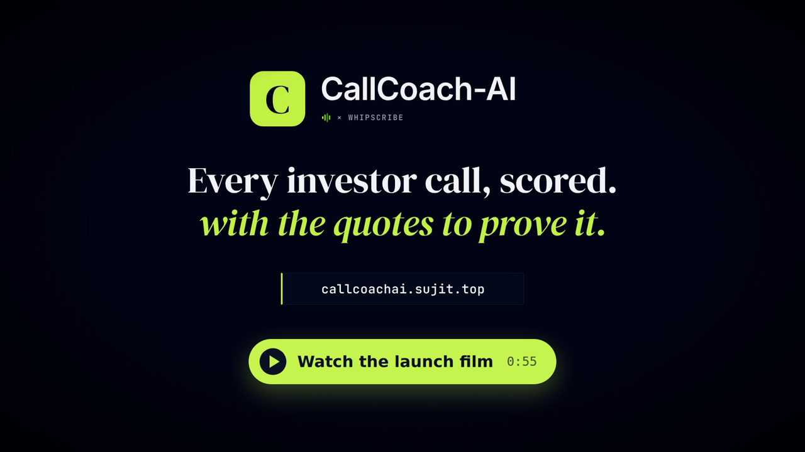
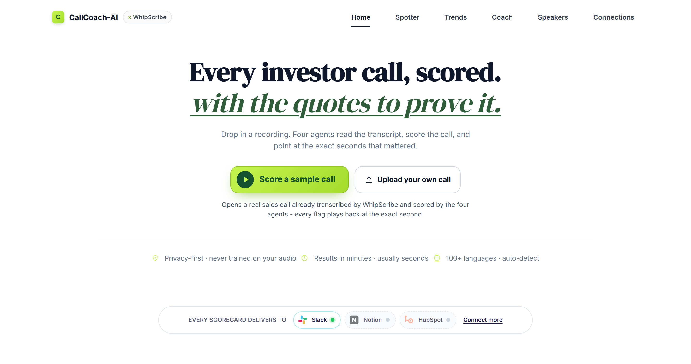
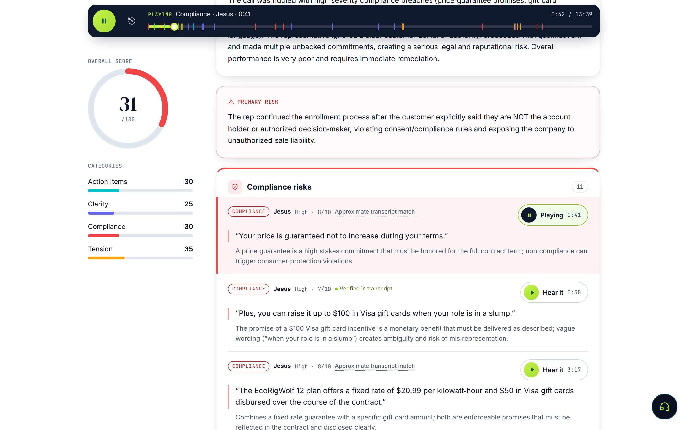
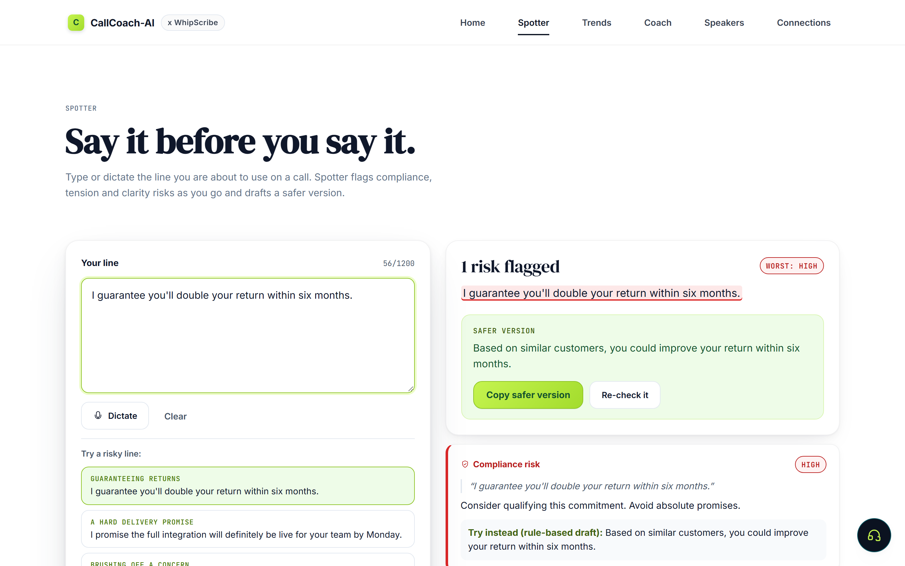
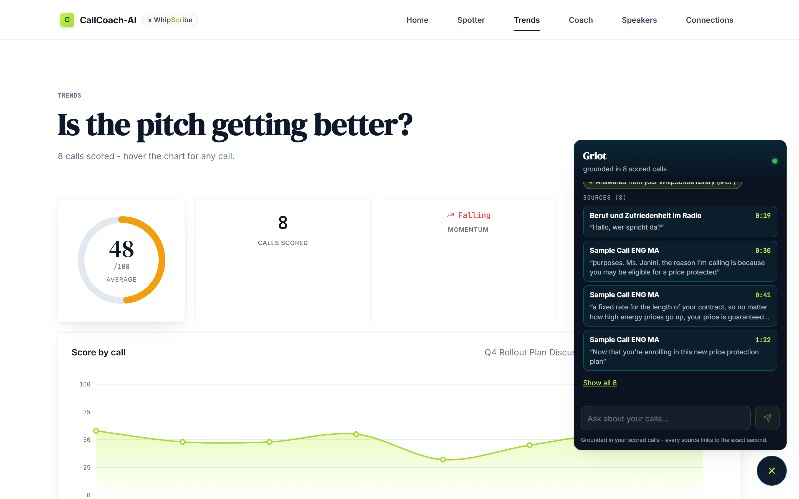

<div align="center">

# CallCoach-AI

### Every investor call, scored, with the quotes to prove it.

Drop in a call recording. CallCoach-AI tells you where the pitch broke, what you promised, and the exact second it happened. Press play to hear it.

**[Try it live →](https://callcoachai.sujit.top/)** &nbsp;·&nbsp; **[▶ Watch the launch film](https://cdn.jsdelivr.net/gh/Blacksujit/whipscribe-buildathon@main/apps/blacksujit/track-4/docs/media/callcoach-launch.mp4)** (0:55, sound on) &nbsp;·&nbsp; [Product walkthrough](https://videotourl.com/videos/1790703784383-893d45c0-0e34-4ade-84b1-0c732fbc65c0.webm)

[](https://github.com/Blacksujit/callcoach-ai-whhipscribe/actions/workflows/ci.yml)

<a href="https://cdn.jsdelivr.net/gh/Blacksujit/whipscribe-buildathon@main/apps/blacksujit/track-4/docs/media/callcoach-launch.mp4" title="Play the CallCoach-AI launch film (0:55)"></a>

<sub>Click to play the film in your browser. You can also <a href="docs/media/callcoach-launch.mp4">download the MP4</a>.</sub>



</div>

---

## Why

A founder raising a round takes 15–20 investor calls a week, and almost never listens to one again. Feedback arrives as a feeling: *"that one went well."*

So the same weak answer survives a dozen pitches. Promises made on a call get forgotten. And there's no way to tell whether the pitch is getting better or just getting repeated.

CallCoach-AI gives every call the review a good mentor would, in under a minute, with the evidence attached.

## What you get

### A scorecard you can listen to

One score, four categories, and the single biggest risk on the call. Every flagged moment has a **▶ Hear it** button that plays the recording from that exact second. You don't have to take the AI's word for it.



| Category | What it catches |
|---|---|
| **Compliance** | Promises you can't keep: guaranteed returns, hard dates, "definitely" |
| **Tension** | Where the other side hesitated, and what you said just before |
| **Clarity** | Hedging, a vague ask, numbers that change between calls |
| **Action items** | Who promised what, and whether it was followed up |

### Spotter: check a line before you say it

Type or dictate what you're about to say. Spotter flags risky wording and suggests a safer version you can copy.



### Trends and Griot: see the pattern, ask anything

See whether your calls are trending up or down, and which issues keep coming back. **Griot**, the chat on every page, answers questions across all your calls, such as *"What did we promise about pricing?"*. Each answer links to the call and second it came from.



### Lands where you work

Every new scorecard goes to **Slack**, **Notion** or **HubSpot** automatically. Each connection is tested with a real message, page or task before it's saved.

## Try it

1. Open **[callcoachai.sujit.top](https://callcoachai.sujit.top/)**.
2. Click **Score a sample call** to open a real, fully scored call instantly.
3. Or **upload your own**: audio or video, a file or a link. You watch it go from transcribing to scored to done.

No sign-up needed to try it.

> The server sleeps when idle. If the first load says *"Waking up the analysis server…"*, give it about 20 seconds.

## How it works

```
Your recording
   │
   ▼
WhipScribe ─── transcript, speakers, timestamps
   │
   ▼
Four AI reviewers ─── compliance · tension · clarity · action items
   │
   ▼
Quote check ─── every flagged line is matched back to the transcript
   │
   ▼
Your scorecard ─── score, top risk, playable evidence  →  Slack · Notion · HubSpot
```

- **Evidence over opinion.** Every quote is checked against the transcript. A line that can't be found is marked unverified and never shown as fact.
- **Your library, searchable.** Griot searches your calls through the [WhipScribe](https://whipscribe.com) MCP server and only answers from what was actually said.
- **Private by default.** Audio is transcribed by WhipScribe and never used to train models.

## Run it yourself

```bash
# Backend: Flask API on :5000
pip install -r requirements.txt
cp .env.template .env        # add WHIPSCRIBE_API_KEY and an LLM key (e.g. GROQ_API_KEY)
python app.py

# Frontend: Next.js on :3000
cd frontend && npm ci
BACKEND_URL=http://localhost:5000 npm run dev:hmr
```

```bash
python -m pytest -q          # 139 tests, run offline, no keys needed
```

Stack: Next.js · Flask · SQLite · WhipScribe API + MCP · Groq / OpenAI / Anthropic.

## What's next

- **Team view:** one coach reviewing every rep's calls side by side.
- **Saved libraries:** today the free hosting resets uploaded calls on each deploy. The demo library is always there; persistent storage comes next.
- **Calendar hook:** score a call automatically when the meeting ends.

## More

- [Decisions: what was built, what was cut, and why](DECISIONS.md)
- [What we learned building on the WhipScribe API](docs/LEARNING.md)
- [The problem, in detail](PROBLEM.md)

<div align="center">

Built by **[Sujit Nirmal](https://github.com/Blacksujit)** on [WhipScribe](https://whipscribe.com).

</div>
